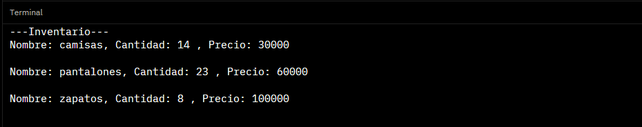
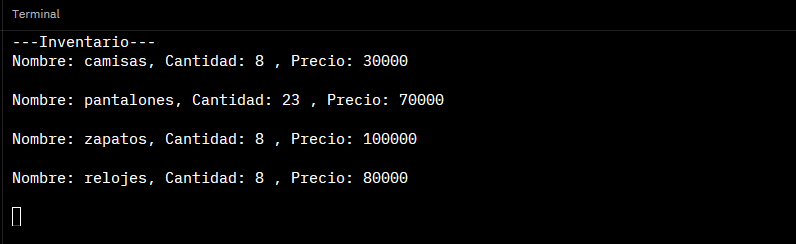
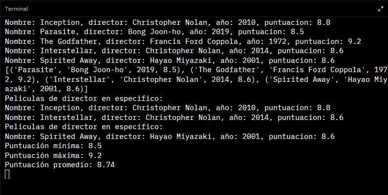
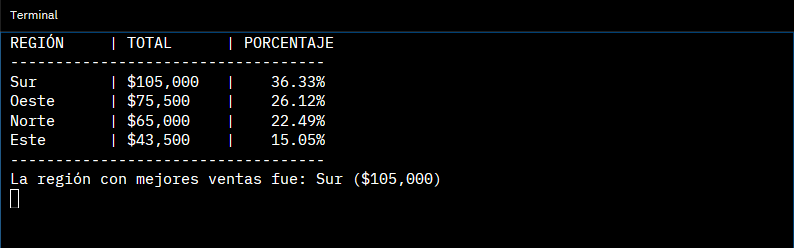
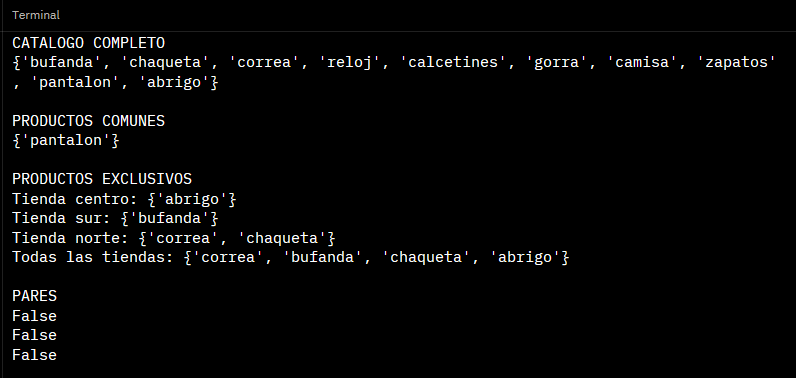
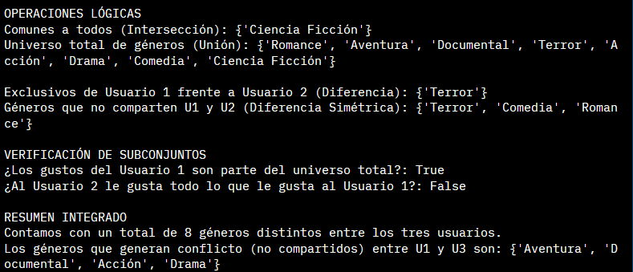
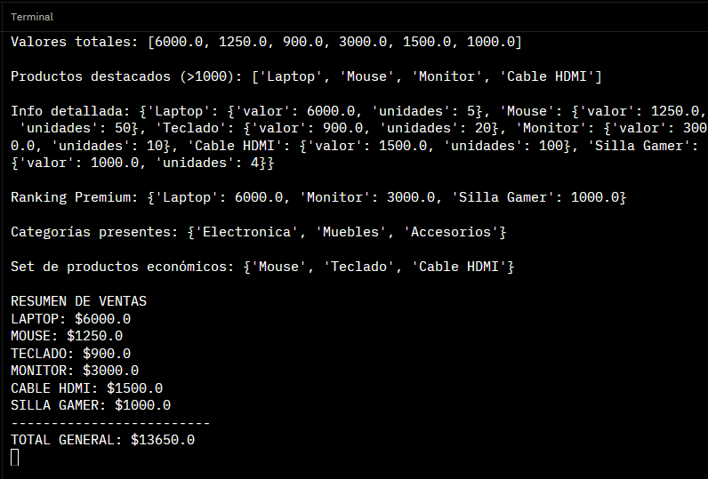

# Fundamentos de Python: Estructuras de Datos en Python

### descripcion

Esta tarea/proyecto de python esta destinada a que podamos entender y dominar las estructuras de datos, un concepto que nos servira bastante en el desarrollo backend que aprenderemos a lo largo de las clases

### Reto 1 (Listas)

#### Explicacion breve de la estructura de datos

Una **lista** en Python es una coleccion ordenada y mutable de elementos. Permite almacenar multiples valores en una sola variable, acceder a ellos por indice y modificar su contenido en cualquier momento. En este ejercicio se usa una lista de diccionarios, donde cada diccionario representa un producto del inventario con sus atributos: nombre, cantidad y precio.

#### Evidencia

#### Descripcion de la accion

El programa define un inventario como lista de diccionarios y expone cuatro operaciones sobre el:

- `actualizar_precio`: recorre la lista hasta encontrar el producto por nombre y reemplaza su precio.
- `registrar_venta`: encuentra el producto y descuenta la cantidad vendida del stock actual.
- `anadir_producto`: agrega un nuevo diccionario al final de la lista con `append`.
- `mostrar_inventario`: itera la lista e imprime los datos de cada producto.

Se ejecutan las cuatro funciones en orden: se actualiza el precio de pantalones a 70000, se registra una venta de 6 camisas, se agrega el producto relojes, y finalmente se imprime el inventario resultante.

### Reto 2 (Tuplas)

#### Explicacion breve de la estructura de datos

Una **tupla** en Python es una coleccion ordenada e **inmutable** de elementos. A diferencia de las listas, no se puede modificar su contenido una vez creada: no se pueden agregar, eliminar ni reemplazar elementos. Se accede a sus valores por indice y soporta desempaquetado directo en variables. En este ejercicio se usa una tupla de subtuplas, donde cada subtupla representa una pelicula con sus campos: nombre, director, año y puntuacion.

#### Evidencia

#### Descripcion de la accion

El programa define un catalogo como tupla de subtuplas y realiza las siguientes operaciones:

- Recorre el catalogo con `for` desempaquetando los cuatro campos de cada subtupla directamente en variables.
- Usa el operador `*` para separar la primera pelicula del resto del catalogo en una sola asignacion.
- `buscar_por_director`: filtra e imprime las peliculas cuyo director coincida con el argumento recibido.
- `obtener_estadisticas`: extrae las puntuaciones con una list comprehension y retorna minimo, maximo y promedio como tupla, que luego se desempaqueta en tres variables.

Se llama a `buscar_por_director` dos veces (Christopher Nolan y Hayao Miyazaki) y se imprime el resultado de las estadisticas con el promedio redondeado a dos decimales.

### Reto 3 (Diccionarios)

#### Explicacion breve de la estructura de datos

Un **diccionario** en Python es una coleccion mutable de pares clave-valor. No tiene orden garantizado por indice como las listas, sino que cada valor se accede por su clave unica. Soporta anidamiento, lo que permite representar estructuras jerarquicas. En este ejercicio se usa un diccionario anidado donde cada clave es una region geografica y su valor es otro diccionario con las ventas por trimestre.

#### Evidencia

#### Descripcion de la accion

El programa define `ventas_por_region` como diccionario anidado y ejecuta las siguientes operaciones:

- Calcula el total anual de cada region con una dict comprehension usando `items()` y `sum()` sobre los valores del diccionario interno.
- Determina la region con mayores ventas usando `max()` con un `lambda` como criterio de comparacion sobre los pares clave-valor.
- Acumula las ventas globales por trimestre con iteracion anidada sobre los valores del diccionario principal.
- Calcula el porcentaje de participacion de cada region sobre el gran total con otra dict comprehension.
- Imprime el reporte ordenado de mayor a menor usando `sorted()` con `reverse=True` y formatea los valores con alineacion de columnas y separadores de miles.

### Reto 4 (Conjuntos)

#### Explicacion breve de la estructura de datos

Un **conjunto** en Python es una coleccion mutable, no ordenada y sin elementos duplicados. No se accede a sus elementos por indice sino mediante operaciones de teoria de conjuntos: union, interseccion, diferencia y diferencia simetrica. Es util cuando lo que importa es la pertenencia de un elemento y no su posicion ni repeticion. En este ejercicio se usan conjuntos para modelar inventarios de tiendas y preferencias de usuarios, aplicando tanto metodos (`union()`, `intersection()`, `difference()`) como operadores (`|`, `&`, `-`, `^`, `<=`).

#### Evidencia

#### Descripcion de la accion

El programa trabaja en dos bloques:

**Inventario de tiendas:**
- Define tres conjuntos representando el stock de cada tienda.
- Calcula el catalogo completo con `union()` entre las tres tiendas.
- Obtiene los productos comunes a las tres con `intersection()`.
- Determina los productos exclusivos de cada tienda con `difference()` respecto a las otras dos, y luego une todos los exclusivos en un solo conjunto.
- Verifica con `isdisjoint()` si algun par de tiendas no comparte ningun producto, imprimiendo `False` en los tres casos porque todas comparten al menos un producto.

**Preferencias de usuarios:**
- Define tres conjuntos de generos cinematograficos para tres usuarios.
- Calcula interseccion, union, diferencias y diferencias simetricas usando operadores simbolicos.
- Verifica con `<=` si los gustos de un usuario son subconjunto del universo total o de otro usuario.
- Imprime un resumen con el total de generos distintos y los generos en conflicto entre U1 y U3.

### Reto 5 (Comprehensions)

#### Explicacion breve de la estructura de datos

Las **comprehensions** en Python son una sintaxis compacta para construir colecciones a partir de iterables, aplicando transformaciones y filtros en una sola expresion. Existen tres variantes: **list comprehension** (`[...]`) que produce una lista ordenada, **dict comprehension** (`{k: v ...}`) que produce un diccionario, y **set comprehension** (`{v ...}`) que produce un conjunto sin duplicados. Todas siguen la misma estructura base: expresion + `for` + iterable + `if` opcional.

#### Evidencia

#### Descripcion de la accion

El programa define una lista de diccionarios con seis productos y aplica las tres variantes de comprehension sobre ella:

- **List comprehension**: calcula el valor total de cada producto multiplicando precio por unidades.
- **List comprehension con filtro**: extrae los nombres de productos cuyo valor total supera 1000.
- **Dict comprehension**: construye un diccionario con nombre como clave y un subdicionario con valor total y unidades como valor.
- **Dict comprehension con filtro y ordenamiento**: genera un ranking de productos con precio unitario mayor a 50, ordenado de mayor a menor valor total con `sorted()`.
- **Set comprehension**: extrae las categorias unicas presentes en el catalogo.
- **Set comprehension con filtro**: obtiene los nombres de productos con precio unitario menor o igual a 50.
- Finalmente construye un resumen formateado con los nombres en mayusculas y calcula el gran total acumulando todos los valores.
